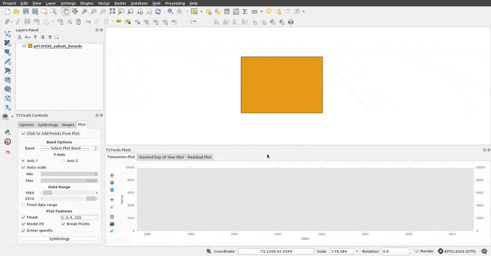
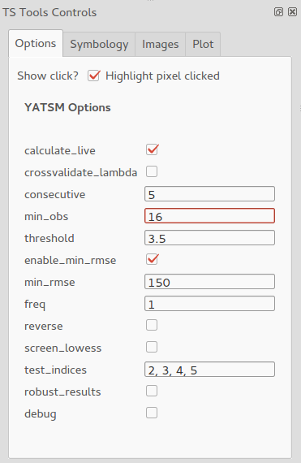
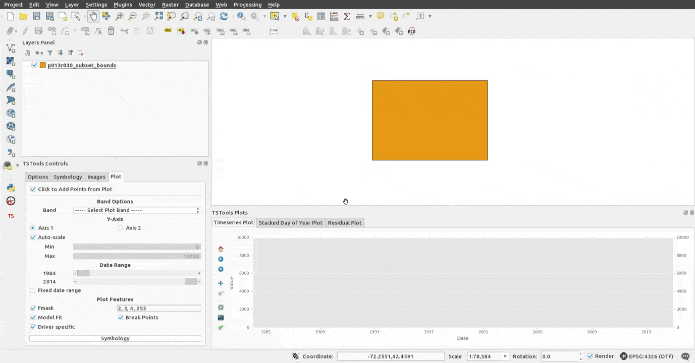
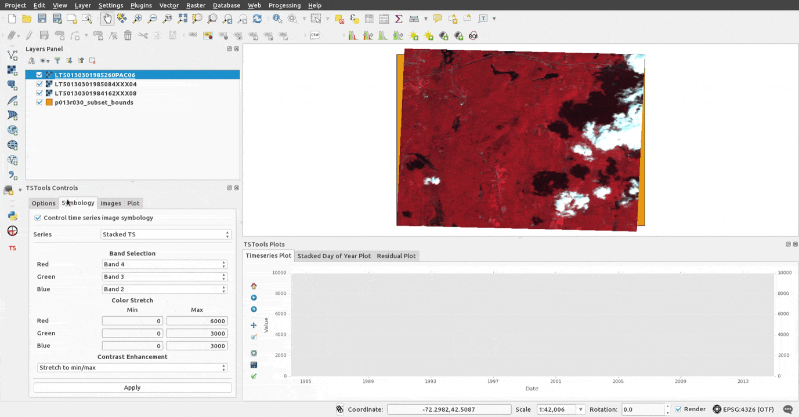
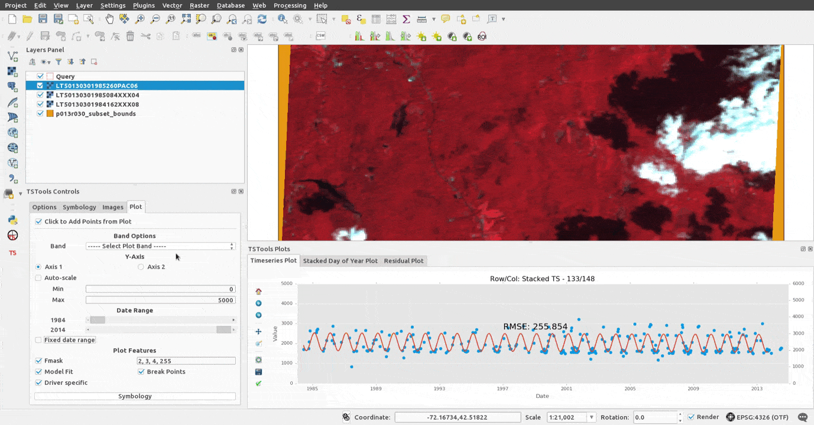

Time Series Tools (TSTools) Quickstart
-------------------------------------

This quickstart does not cover installation, but instead describes and shows what is possible using the plugin using some examples from this [example dataset](https://github.com/ceholden/landsat_stack).

For installation instructions, please see the [README of this repository](../README.md). These instructions detail how to install a built version of TSTools into your QGIS plugins folder, or how to launch TSTools in a Ubuntu 14.04 virtual machine using ran with VirtualBox and provisioned using Vagrant.

## Dataset

Currently the only supported dataset structure is a time series containing "layer stacked" images. All images within this "stacked" dataset must have the same geographic extent and all image bands must be within one single file. There are plans to support other types of dataset structures, including datasets with heterogeneous image extents or with image data spread across multiple files.

An example dataset that conforms to the specifications required by the existing time series "drivers" can be downloaded [here](https://github.com/ceholden/landsat_stack).

## Initialize a time series driver

This plugin uses "drivers" or "handlers" of specific time series applications that interface with the user interface. These drivers may require unique information to initialize them and are used by the plugin to retrieve information such as image filenames, time series data, or model fits. Drivers for CCDC have already been implemented, but other algorithms such as LandTrendr or BFAST could be visualized within TSTools if drivers were developed to handle their datasets and model results.

In the example below, I initialize a time series driver for the non-reference, "CCDC-esque" port based on a version of CCDC in 2014 from the ["Yet Another time series Model" (YATSM) package](https://github.com/ceholden/yatsm), by locating the directory containing the time series data.

This time series driver not only can read in results calculated in "batch" for an entire dataset, but users can experiment live with model parameters using a series of forms on the "Options" tab:

The pairing between model parameters and the user interface widgets was almost automatic. The time series driver only had to specify variable names and default values to be used for reach configuration option. The datatype of these default values controls what type of widget will be generated.

## Add time series images and control symbology

The "Images" tab of the TSTools Control Panel contains a listing of all images found within the selected directory. A click of a checkbox will add any one of the images to be visualized within QGIS.

To facilitate comparison among images, the "Symbology" tab controls the Red-Green-Blue symbology for every image added through the plugin. Users may specify the minimum and maximum values for their dataset to be stretched to 0 - 255 displayed colors. All contrast enhancement methods available within QGIS may be applied in the raster symbology, but the enhancement defaults to "Stretch to min/max".

## Plot time series across years

Once an image has been added from the time series, the TSTools Click Tool will retrieve and plot the time series for any pixel the user clicks.

At first, nothing is plotted within TSTools. Users must add individual dataset bands to the plot by clicking on the "Band" combobox. Bands may be added to either axis: one click for axis 1, two clicks for axis 2. A third click sets a band to be "off" and a fourth would add the band to axis 1.

The algorithm results can be turned on or off by unchecking the `Model Fit` (or predictions) and `Break Points` boxes to help assess without bias whether the model successfully captures patterns visible in the time series. The `Driver specific` checkbox controls the display of plot features potentially added by a time series driver.

Two text edit boxes control the minimum and maximum range of values that are displayed for `Axis 1` (left) and `Axis 2` (right). Use the two circular "radio" buttons labeled `Axis 1` and `Axis 2` to change the axis edited by the minimum and maximum value text boxes. When `Auto-scale` is checked, TSTools will automatically calculate the minimum and maximum values as the 2nd/98th percentiles of the bands currently displayed. If more than one band is plotted, the minimum and maximum for used all bands will equal the range of minimums/maximums calculated for the displayed bands. The option to change the scaling behavior is on the future TODO list.

The two sliders under the `Date Range` label control the minimum and maximum years of data that are plotted by TSTools. For the `Timeseries Plot` and `Residual Plot` figures, these `Date Range` sliders clearly control the `x-axis`. However, these sliders technically control the subset of the data plotted by filtering based on the year of the observation. The sliders work with the `Stacked Day of Year Plot`, which only maps the day of the year for each observation to the `x-axis`, by manipulating the range of years on the plot (also visualized with the colorbar).

## Plot time series within a year

To help assess whether or not the time series break detected by the algorithm is correct, the X-axis can be manipulated to increase plot resolution by decreasing the amount of data plotted. I begin by subsetting the plot to just the data within the first time period.

The "Stacked Day of Year Plot" is a very useful visualization for representing variation in reflectance from phenology and view/illumination geometry. The `x-axis` no longer contains information across years -- this information is instead visualized as a progression across a color gradient.

The example above demonstrates the yearly phenological pattern of a stable deciduous forest. If this forest was not stable because of past disturbance or was converted during the time series dataset, the DOY plot is useful to track the variation in intra-annual pattern for cover types affected by gradual or abrupt change.

## Point to Image

Time series can be very informative when trying to infer the history of a pixel. Probably the best feature in this plugin is the ability to tie these time series observations on either graph back to the corresponding images.

Clicking any point in either the "Time Series Plot" or the "Stacked Day of Year Plot" will add the corresponding image to QGIS list of displayed layers. In this example, I trace the anomaly detected in the time series to what looks like a large flooding event.

Points that are drawn on top of or very close to other points may be difficult to add if the clickable buffers overlap. In these circumstances, decrease the amount of data plotted on the X or Y axis to increase the distance among the points.

## Ancillary data

The TSTools plugin is built on top of QGIS, an excellent Geographic Information System program. Ancillary data from shapefiles, geospatial databases, rasters, or web resources are easily importable into QGIS. The very same plugin infrastructure that allows TSTools to exist allows enables others to create powerful utilities.

One such utility is the ["OpenLayers Plugin"](https://github.com/sourcepole/qgis-openlayers-plugin) which can display basemaps of high-resolution satellite imagery from sources including Google and Bing.

## Plot Symbology

A very simplistic and primitive symbology engine has been implemented for the "Time Series Plot". time series drivers can define variables to be used as plot symbology and the plugin will setup symbology controls for these values. Users can also add their own categorical metadata by opening a CSV file containing columns of metadata and a column used for a match index (e.g., the image ID or image date).

Here I show a quick example which distinguishes observations from Landsat TM4, TM5, ETM+:

There is no planned support for mapping continuous variables to categorical labels within the interface, but driver can handle this if needed. This feature has been very helpful when used to plot observations removed during CCDC from the multitemporal cloud and shadow screening algorithm - "TMask".
